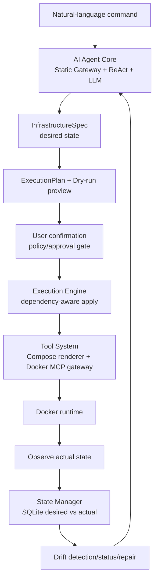
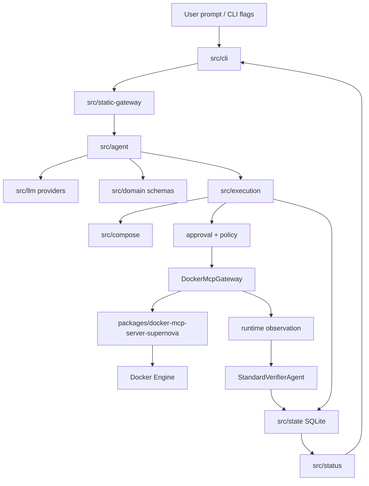
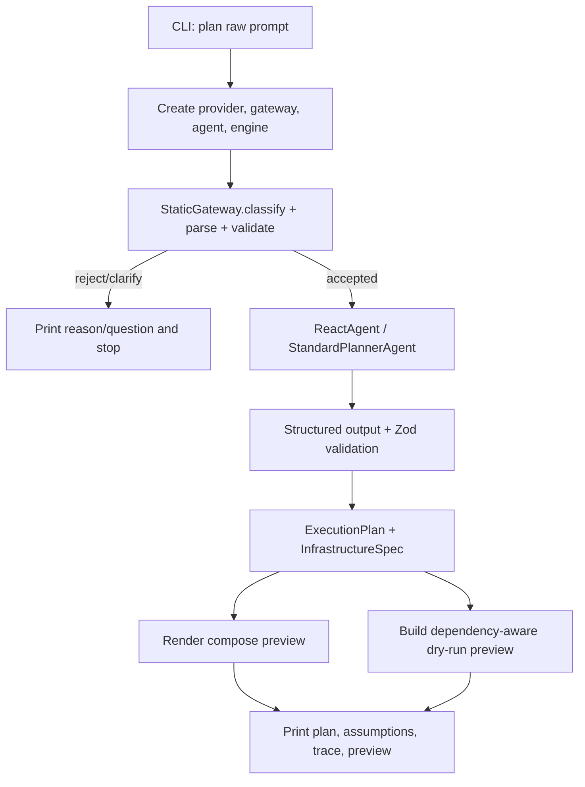
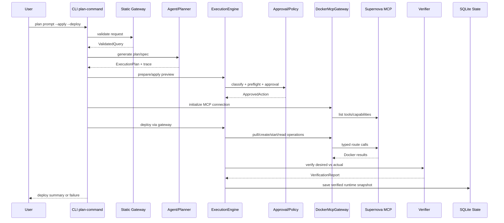
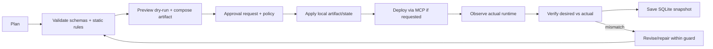
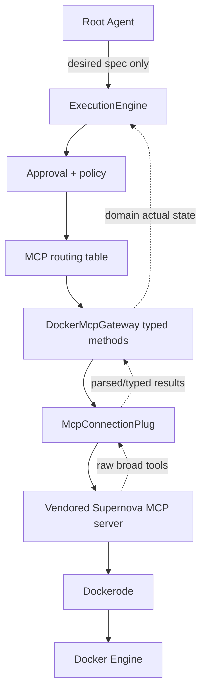

# Codebase Deep Dive: Infra ReAct Agent

Tài liệu này là bản phân tích kỹ thuật dài cho repository `ai_infra_llm`. Mục tiêu là giúp một kỹ sư mới đọc được toàn bộ bức tranh: repository này giải quyết vấn đề gì, folder/file nào chịu trách nhiệm gì, các module giao tiếp ra sao, schema nào là boundary an toàn, fallback nằm ở đâu, và phần nào đã là implementation thật so với phần còn là định hướng.

> Trạng thái tài liệu: phản ánh code trong worktree hiện tại tại thời điểm viết. Tài liệu cố tình tránh khẳng định quá mức: Docker Compose là artifact được render từ spec, còn source of truth cho desired state là `InfrastructureSpec`; runtime mutation phải đi qua validation, policy, approval và gateway, không phải do LLM gọi Docker trực tiếp.

## Mục lục

- [0. Bám sát đề bài và lời dặn mentor](#0-bám-sát-đề-bài-và-lời-dặn-mentor)
- [1. Tổng quan dự án](#1-tổng-quan-dự-án)
- [2. Bản đồ repository](#2-bản-đồ-repository)
- [3. Luồng CLI và control flow](#3-luồng-cli-và-control-flow)
- [4. Domain model, schema và validation](#4-domain-model-schema-và-validation)
- [5. Agent, planner, verifier và fallback](#5-agent-planner-verifier-và-fallback)
- [6. Compose, execution, approval và runtime](#6-compose-execution-approval-và-runtime)
- [7. Persistence, status và observability](#7-persistence-status-và-observability)
- [8. Vendored Docker MCP server](#8-vendored-docker-mcp-server)
- [9. Tests, docs và chất lượng](#9-tests-docs-và-chất-lượng)
- [10. Cách đọc codebase theo nhiệm vụ](#10-cách-đọc-codebase-theo-nhiệm-vụ)
- [11. Rủi ro thiết kế và nguyên tắc mở rộng](#11-rủi-ro-thiết-kế-và-nguyên-tắc-mở-rộng)
- [12. Phụ lục tra cứu nhanh](#12-phụ-lục-tra-cứu-nhanh)

## 0. Bám sát đề bài và lời dặn mentor

### 0.1 Bài toán gốc

Đề bài yêu cầu xây dựng một hệ thống cho phép người dùng quản lý hạ tầng bằng lệnh ngôn ngữ tự nhiên. Người dùng không viết trực tiếp Docker Compose, Docker command hoặc API payload; thay vào đó, họ mô tả mong muốn như:

```text
Tạo một web application gồm nginx reverse proxy, 2 instance node.js backend,
và 1 postgresql database
```

Hệ thống dùng AI Agent theo kiến trúc ReAct để phân tích yêu cầu, lập kế hoạch, hiển thị preview/dry-run, xin xác nhận, triển khai hạ tầng và theo dõi trạng thái. Đây là bài toán kết hợp giữa natural-language interface, AI planning, infrastructure-as-code artifact generation, runtime execution và state reconciliation.

### 0.2 Mapping đề bài vào codebase hiện tại

| Yêu cầu đề bài                        | Mapping trong codebase                                                                                    | Trạng thái                                                                                                           |
| ------------------------------------- | --------------------------------------------------------------------------------------------------------- | -------------------------------------------------------------------------------------------------------------------- |
| CLI nhập lệnh ngôn ngữ tự nhiên       | `src/cli/plan-command.ts`, `src/cli/main.ts`                                                              | Implemented                                                                                                          |
| Agent phân tích yêu cầu               | `src/static-gateway/static-gateway.ts`, `src/agent/react-agent.ts`, `src/agent/standard-planner-agent.ts` | Implemented                                                                                                          |
| ReAct Reason → Act → Observe → Repeat | `src/agent/react-agent.ts`, internal tools, traces, closed-loop deploy                                    | Implemented/đang mở rộng                                                                                             |
| Tạo execution plan                    | `ExecutionPlan` trong `src/domain/types.ts`, planner/agent output                                         | Implemented                                                                                                          |
| Dry-run xem trước thay đổi            | `DetailedDryRunPreview`, `ExecutionEngine`, dependency schedule                                           | Implemented                                                                                                          |
| Xác nhận trước khi thực thi           | `src/execution/phase8-approval.ts`, CLI approval helpers                                                  | Implemented cho guarded apply/deploy path                                                                            |
| Sinh Docker Compose YAML              | `src/compose/render-compose.ts`                                                                           | Implemented                                                                                                          |
| Triển khai Docker                     | `DockerMcpGateway`, vendored Supernova MCP server, deploy loop                                            | Implemented theo guarded MCP path; cần Docker runtime để chạy thật                                                   |
| Quản lý state                         | `src/state/sqlite-state-store.ts`                                                                         | Implemented bằng SQLite                                                                                              |
| `show status`                         | `src/status/status-service.ts`, CLI `status`                                                              | Implemented                                                                                                          |
| `destroy all`                         | CLI `destroy-all`, execution destroy flow                                                                 | Implemented theo guarded runtime path                                                                                |
| Phát hiện drift                       | `src/execution/drift-detector.ts`, `status --drift`, verifier                                             | Implemented/được test ở các scenario chính                                                                           |
| LLM provider                          | `src/llm/provider.ts`                                                                                     | OpenAI/Gemini path có trong code; Test provider cho deterministic dev/test; Ollama chưa thấy implementation hiện tại |
| Container runtime                     | Docker qua MCP server/Dockerode; Compose YAML artifact                                                    | Implemented theo boundary root gateway ↔ MCP server                                                                  |
| State storage JSON/YAML hoặc SQLite   | SQLite `state/infra-state.sqlite`                                                                         | Implemented                                                                                                          |

Tài liệu này vì vậy không chỉ mô tả “repo có những file nào”, mà còn giải thích cách từng phần phục vụ đề bài: CLI, AI Agent Core, Tool System, State Manager và Execution Engine.

### 0.3 Kiến trúc hệ thống theo yêu cầu mentor

Đề bài chia hệ thống thành bốn khối lớn. Codebase hiện tại mapping như sau:

- **AI Agent Core**: nằm chủ yếu trong `src/agent`, `src/static-gateway` và `src/llm`. Khối này nhận lệnh tự nhiên, gọi LLM provider khi cần, suy luận topology hạ tầng, tạo `InfrastructureSpec` và `ExecutionPlan`, đồng thời ghi lại trace reason/action/observe.
- **Tool System**: gồm hai tầng. Tầng internal tools nằm trong `src/agent/internal-tools.ts` và registry; tầng runtime tools đi qua `src/execution/mcp-routing-table.ts`, `src/execution/docker-mcp-gateway.ts` và vendored server `packages/docker-mcp-server-supernova`. Mentor dặn không để agent có broad Docker API; vì vậy tool system phải được route, typed, policy-controlled.
- **State Manager**: nằm trong `src/state/sqlite-state-store.ts`, `src/status/status-service.ts`, drift detector và verifier. Nó lưu desired state, actual observed state, pending preview, approval/action history và hỗ trợ so desired vs actual để phát hiện drift.
- **Execution Engine**: nằm trong `src/execution/execution-engine.ts` và các module phụ như dependency schedule, approval, runtime readers, repair planner. Nó thực thi theo thứ tự dependency, hỗ trợ dry-run, apply, deploy, observe, repair và destroy.

Sơ đồ mentor-level:



### 0.4 Những lời dặn mentor được tài liệu này nhấn mạnh

Các lời dặn quan trọng trong `AGENTS.md` và định hướng kiến trúc của repo được lặp lại xuyên suốt tài liệu:

- Không để **Act phase** trở thành raw Docker API escape hatch.
- Tách rõ **agent intent**, **tool/runtime capability**, **policy/approval** và **runtime observation**.
- Luồng runtime phải là **plan → validate → preview → approve → apply → observe**.
- `InfrastructureSpec` là source of truth; Docker Compose YAML chỉ là artifact render ra.
- LLM không được trực tiếp tạo low-level Docker payload mà không qua domain schema.
- Runtime side effects phải typed, validated, observable và policy-controlled.
- Drift detection phải so desired state đã lưu với actual Docker state được observe, không chỉ kiểm tra file Compose tồn tại.
- MCP server nếu dùng phải là guarded capability layer cho execution engine, không phải remote shell cho agent.

### 0.5 Phạm vi “Giai đoạn 1 — Mini Project CLI” trong repo

Giai đoạn 1 trong đề bài yêu cầu một CLI mini project. Codebase hiện tại đã vượt mức scaffold tối thiểu ở nhiều điểm, nhưng tài liệu này vẫn tổ chức theo mindset giai đoạn 1:

1. Nhập prompt bằng CLI.
2. Static validation để loại request không phù hợp.
3. Agent tạo plan/spec.
4. Dry-run hiển thị những gì sẽ tạo.
5. User xác nhận.
6. Sinh Docker Compose YAML.
7. Deploy Docker qua gateway được kiểm soát.
8. Lưu state.
9. Status/destroy/drift/repair.

Khi đọc code, hãy luôn hỏi: phần này phục vụ bước nào trong flow Mini Project CLI? Nếu một module không phục vụ trực tiếp flow đó, nó có thể là extension hoặc hỗ trợ cho runtime safety.

## 1. Tổng quan dự án

### 1.1 Mục tiêu sản phẩm

Repository này đang xây dựng một CLI quản lý hạ tầng bằng ngôn ngữ tự nhiên. Người dùng nhập yêu cầu như “Create a web application with nginx, 2 node backends, and postgres”; hệ thống sẽ diễn giải intent, tạo mô hình hạ tầng có type rõ ràng, render Docker Compose preview, lưu trạng thái vào SQLite, và trong luồng deploy có thể đi qua MCP gateway để thao tác Docker runtime có kiểm soát.

Điểm quan trọng là sản phẩm không coi LLM là runtime executor trực tiếp. LLM có thể hỗ trợ diễn giải yêu cầu và đề xuất spec, nhưng spec đó phải đi qua các lớp schema, policy, approval, execution và observation. Đây là khác biệt cốt lõi giữa “LLM tạo một file YAML” và “agent hạ tầng có boundary an toàn”.

Các mục tiêu kỹ thuật hiện có trong codebase:

- Nhận request tự nhiên qua CLI và chuẩn hoá thành intent hạ tầng.
- Chặn request out-of-scope, unsafe hoặc thiếu thông tin bằng Static Gateway trước khi vào ReAct loop.
- Sinh `InfrastructureSpec` làm desired-state model chính.
- Sinh `ExecutionPlan` mô tả quy trình validate, preview, approve, apply, observe và verify.
- Render Docker Compose YAML deterministic từ spec để preview hoặc hỗ trợ execution.
- Lưu pending preview, approved action, current verified runtime snapshot, drift/repair reports và operation history trong SQLite.
- Giao tiếp Docker runtime thông qua vendored Docker MCP server, nhưng route qua root `DockerMcpGateway`, routing table, policy và approval gate.
- Đọc actual runtime sau deploy/observe để so với desired state.

### 1.2 Tư duy ReAct trong repo

`ReAct.pdf` là tài liệu nền về mô hình Reason + Act. Repo này áp dụng ý tưởng đó vào hạ tầng:

- **Reason**: hiểu yêu cầu người dùng, xác định intent, topology, phụ thuộc, rủi ro, missing information và assumptions.
- **Act**: gọi internal tools, tạo plan, validate spec, render Compose, chuẩn bị approval, gọi gateway để deploy/destroy/observe khi được phép.
- **Observe**: thu observation từ schema validation, static checks, Docker MCP read tools, verification report, drift report và SQLite state.
- **Repeat**: nếu deploy thất bại hoặc verifier phát hiện mismatch, planner có thể patch/revise spec trong closed-loop deploy thay vì dừng ngay ở lỗi đầu tiên.

Trong code, ReAct không nên bị hiểu là “LLM muốn gì thì làm nấy”. Agent chỉ quyết định bước logic tiếp theo; tool/runtime capability mới quyết định operation nào tồn tại; policy/approval quyết định operation đó có được chạy hay không; observation/state ghi nhận sự thật runtime.

### 1.3 Source of truth và artifact

Source of truth cho desired state là `InfrastructureSpec`. Docker Compose YAML chỉ là artifact render từ spec. SQLite không thay thế runtime observation: SQLite lưu các snapshot đã được hệ thống ghi nhận, nhưng trạng thái Docker thật chỉ được xác nhận khi có observe/verify từ runtime.

Ba lớp cần tách rõ:

- **Desired model**: `InfrastructureSpec` mô tả project, services, networks, volumes.
- **Procedural plan**: `ExecutionPlan` và schedule mô tả trình tự thao tác.
- **Runtime artifact/state**: Compose YAML, Docker containers/images/networks/volumes, SQLite snapshots.

Nếu tài liệu hoặc code lẫn lộn ba lớp này, hệ thống sẽ dễ rơi vào trạng thái “file YAML tồn tại nên nghĩ runtime đúng”, hoặc “LLM nói đã deploy nên tin là đã deploy”. Codebase cố gắng chống lại điều đó bằng schema validation, preflight, approval, MCP observation và status/drift report.

### 1.4 Trạng thái implementation hiện tại

Worktree hiện tại có implementation rộng hơn scaffold ban đầu. Các phần đã hiện diện trong `src/` và `packages/` gồm:

- CLI command surface cho planning, apply/deploy, doctor, observe, status, drift, repair, destroy và destroy-all.
- Static Gateway trước ReAct để classify intent, parse structured query, validate image/resource/security/resource limits.
- ReAct-style agent, standard planner, standard verifier, internal tools, loop guard và closed-loop guard.
- LLM provider abstraction với test provider, OpenAI provider, Gemini provider config path và fallback provider.
- Domain schemas/types lớn cho spec, state, approval, runtime actual state, drift, repair, verification, structured outputs.
- Compose renderer, generated secrets writer và secret resolver.
- Execution engine cho dry-run preview, apply preparation, deploy/destroy/observe/repair-related flows.
- Phase 8 approval/preflight helpers.
- MCP connection plug, route table, policy, parser và Docker MCP gateway.
- SQLite state store và status service.
- Vendored Docker MCP server trong `packages/docker-mcp-server-supernova` với nhiều tool Docker.
- Test suite root và test suite riêng cho vendored MCP package.

Các phần cần đọc với nhãn thận trọng:

- Runtime/MCP đã có code path thực, nhưng vẫn phải được hiểu là guarded execution qua root gateway, không phải public broad Docker API.
- Provider support có OpenAI/Gemini path, nhưng test/stub/fallback vẫn quan trọng cho deterministic development.
- State trong SQLite là evidence của lần hệ thống lưu/observe, không tự động chứng minh runtime hiện tại vẫn khớp nếu Docker thay đổi ngoài hệ thống.

### 1.5 Sơ đồ module cấp cao



## 2. Bản đồ repository

### 2.1 Root files và config

Root repository chứa các file định hướng build, test, format và runtime:

- `package.json`: định nghĩa package root `infra-react-agent`, CLI binaries `aiagent` và `infra-react-agent`, scripts development/build/test, dependency runtime và dev dependency. Đây là nguồn chính để biết command nào được hỗ trợ ở cấp npm.
- `package-lock.json`: lock dependency root. Không nên sửa thủ công.
- `tsconfig.json`: cấu hình TypeScript cho typecheck/dev.
- `tsconfig.build.json`: cấu hình TypeScript build ra `dist`.
- `vitest.config.ts`: cấu hình Vitest cho test root.
- `eslint.config.js`: cấu hình lint theo ESLint flat config.
- `.prettierrc.json`: định dạng Prettier.
- `.gitignore`: loại trừ generated/runtime artifacts.
- `README.md`: tài liệu public hiện tại, mô tả command surface, architecture, source of truth và runtime flow.
- `AGENTS.md`: hướng dẫn cho agent làm việc trong repo; đặc biệt nhấn mạnh separation giữa agent intent, runtime capability, policy/approval và observation.
- `ReAct.pdf`: tài liệu tham khảo paper ReAct; dùng làm nền tư duy, không phải code module.
- `docker-compose.yaml`: artifact Compose ở root. Khi đọc cần phân biệt đây không phải desired-state canonical model; canonical model là `InfrastructureSpec`.
- `state/`: chứa runtime state SQLite hoặc artifacts cục bộ. Tài liệu này không phân tích nội dung runtime database vì đó là trạng thái máy hiện tại, không phải source code.

Các npm scripts quan trọng:

| Script                                  | Vai trò                                                  |
| --------------------------------------- | -------------------------------------------------------- |
| `npm run dev`                           | Chạy CLI bằng `tsx src/cli/index.ts`.                    |
| `npm run build`                         | Build TypeScript root bằng `tsc -p tsconfig.build.json`. |
| `npm run start`                         | Chạy CLI đã build từ `dist/cli/index.js`.                |
| `npm run typecheck`                     | Typecheck không emit.                                    |
| `npm run lint`                          | Chạy ESLint toàn repo.                                   |
| `npm test`                              | Chạy Vitest root.                                        |
| `npm run format`                        | Prettier write toàn repo.                                |
| `npm run format:check`                  | Prettier check toàn repo.                                |
| `npm run build:supernova-mcp`           | Build vendored MCP package.                              |
| `npm run test:supernova-mcp`            | Test vendored MCP package.                               |
| `npm run test:e2e:docker-mcp`           | Chạy e2e Docker MCP subset.                              |
| `npm run test:e2e:docker-mcp:all-tools` | Chạy e2e nhiều MCP tools.                                |
| `npm run test:chaos`                    | Chạy chaos pipeline test.                                |
| `npm run test:pipeline`                 | Chạy chaos + e2e Docker MCP pipeline.                    |

### 2.2 `src/cli`: entrypoint và command surface

`src/cli` là lớp tiếp xúc người dùng. Nó không nên chứa logic domain sâu hoặc gọi Docker low-level trực tiếp; nhiệm vụ của nó là parse command/flags, gọi service phù hợp, in output và set exit code.

- `src/cli/index.ts`: entrypoint cực mỏng, thường chỉ import/call main CLI bootstrap.
- `src/cli/main.ts`: định nghĩa các command non-plan hoặc command tổng như `doctor`, `observe`, `status`, `repair`, `destroy`, `destroy-all`. File này kết nối state store, gateway, execution engine, doctor/status services và output formatting.
- `src/cli/plan-command.ts`: command `plan` và các biến thể `--save-state`, `--apply`, `--deploy`. Đây là luồng tự nhiên nhất để hiểu request → Static Gateway → agent → preview/apply/deploy.
- `src/cli/shared.ts`: helper dùng chung cho CLI: tạo provider/agent/engine, parse options/env, request approval/clarification, lưu verified runtime snapshot, formatting output hoặc error helpers.
- `src/cli/deploy-loop.ts`: closed-loop deploy orchestration. File này nối agent, execution engine, MCP gateway, verifier, approval/revision prompts và guard để deploy có feedback loop.

CLI nên được đọc như orchestration shell, không phải domain source of truth. Nếu cần biết một field có hợp lệ không, đọc `src/domain`; nếu cần biết Docker operation có được phép không, đọc `src/execution`; nếu cần biết user-facing command gọi thứ tự nào, đọc `src/cli`.

### 2.3 `src/static-gateway`: cổng kiểm tra trước ReAct

`src/static-gateway/static-gateway.ts` là lớp tiền xử lý trước khi request đi vào ReAct agent. Nó làm các việc:

- Classify intent: infrastructure, out-of-scope, unsafe.
- Parse structured query từ prompt thành draft query/service query.
- Chuẩn hoá alias image/resource name.
- Validate static rules: image whitelist, security risk, resource limit, missing information, destructive intent.
- Ước lượng resource để chặn request quá lớn trước khi runtime hoặc agent tốn chi phí.
- Sinh `ValidatedQuery` hoặc rejection/clarification result.

Static Gateway là tuyến phòng thủ đầu tiên. Nó không nên gọi Docker runtime trong static validation. Metric `StaticGatewayMetrics` có các counter để phát hiện lỗi thiết kế như runtime call xảy ra trong static validation hoặc ReAct bị invoke sau static validation failure.

### 2.4 `src/domain`: type, schema và policy data

`src/domain` là lớp quan trọng nhất để hiểu contract của hệ thống:

- `src/domain/types.ts`: khai báo TypeScript interfaces/types cho CLI options, query, spec, execution plan, dry-run preview, approval, runtime actual state, verification, drift, repair, SQLite snapshots và nhiều result objects.
- `src/domain/schemas.ts`: Zod schemas validate runtime data/LLM output/state payload. Đây là boundary thực thi, không chỉ documentation.
- `src/domain/structured-output-schemas.ts`: JSON-schema-like definitions dùng cho structured LLM output, đặc biệt planner/verifier structured responses.
- `src/domain/supported-images.ts`: danh mục image được support/normalize/whitelist hoặc helper liên quan đến image safety.
- `src/domain/stateful-database-volumes.ts`: logic nhận diện database service cần volume stateful, derive volume naming và enforce volume behavior cho DB.

Nếu muốn thêm field vào spec hoặc runtime report, thường phải cập nhật cả `types.ts`, `schemas.ts`, structured output schema, generator/consumer tương ứng và tests.

### 2.5 `src/agent`: ReAct, planner, verifier và tools nội bộ

`src/agent` chứa logic “suy nghĩ và hành động” ở cấp agent:

- `src/agent/react-agent.ts`: ReAct agent orchestration lớn nhất. Nó quản lý trace, reason/act/observe, gọi planner/tools, xử lý result và assumptions.
- `src/agent/standard-planner-agent.ts`: planner chuẩn để biến request/query/runtime context thành `InfrastructureSpec` hoặc patch/update spec. Nó chịu trách nhiệm mapping prompt sang topology hợp lệ.
- `src/agent/standard-verifier-agent.ts`: verifier chuẩn để so desired spec với actual runtime observations, sinh verification report/finding.
- `src/agent/internal-tools.ts`: các tool nội bộ agent có thể dùng, ví dụ validate spec, render/preview hoặc inspect capability theo boundary an toàn.
- `src/agent/tool-registry.ts`: registry tool definitions; giúp tránh tool gọi tuỳ tiện.
- `src/agent/tool-types.ts`: type cho tool registry/tool call/tool result.
- `src/agent/loop-guard.ts`: guard chống vòng lặp agent vô hạn hoặc lỗi retry không kiểm soát.
- `src/agent/closed-loop-guard.ts`: guard cho closed-loop deploy/revision, giới hạn attempt và điều kiện dừng.
- `src/agent/spec-patch-applier.ts`: áp dụng spec patch/revision an toàn, dùng khi planner sửa spec sau feedback.
- `src/agent/agent-interfaces.ts`: interface giữa planner/verifier/runtime reader hoặc agent collaborators.

Điểm cần nhớ: `src/agent` không nên bypass schema/policy để gọi Docker trực tiếp. Khi cần runtime action, agent đi qua execution/gateway boundary.

### 2.6 `src/llm`: provider abstraction và fallback

`src/llm` cô lập provider-specific code:

- `src/llm/provider.ts`: định nghĩa `LlmProvider`, request/response interfaces, `TestLlmProvider`, `OpenAiLlmProvider`, `GeminiLlmProvider`, `FallbackLlmProvider`, config builders và provider factory.
- `src/llm/json-response.ts`: helper parse JSON response từ text, thường cần khi provider output có Markdown fence hoặc extra text.

Provider abstraction giúp agent không phụ thuộc trực tiếp vào OpenAI/Gemini SDK shape. Khi thêm provider mới, logic request/response formatting nên nằm ở đây, không leak vào `src/agent`.

Fallback behavior quan trọng:

- Test/stub provider giúp deterministic tests và dev mode.
- OpenAI/Gemini provider có config riêng từ env/options.
- Fallback provider có thể thử provider chính rồi chuyển sang provider fallback nếu lỗi config/call thuộc loại cho phép.
- JSON response parser là lớp chịu lỗi output format, nhưng không thay thế schema validation.

### 2.7 `src/compose`: artifact rendering và secrets

`src/compose` render artifact và xử lý secrets cho Compose:

- `src/compose/render-compose.ts`: nhận `InfrastructureSpec`, sinh Docker Compose YAML deterministic. File này nên giữ pure/deterministic tối đa để test dễ.
- `src/compose/secret-resolver.ts`: resolve/generate secret placeholders hoặc env secrets phục vụ service environment.
- `src/compose/generated-secrets-writer.ts`: ghi generated secrets ra artifact phù hợp khi apply/deploy yêu cầu.

Compose YAML là output để người dùng xem hoặc execution dùng. Không nên đọc ngược Compose làm source of truth trừ khi có module sync/migration rõ ràng.

### 2.8 `src/execution`: execution engine, runtime boundary và policy

`src/execution` là lớp lớn nhất sau agent/domain. Nó sở hữu runtime orchestration và Docker boundary:

- `src/execution/execution-engine.ts`: engine chính cho preview/apply/deploy/destroy/observe helpers. Nó kết nối Compose renderer, dependency schedule, state store, gateway và verification-related results.
- `src/execution/dependency-schedule.ts`: tạo dependency-aware execution schedule từ spec; tính graph, start order, destroy order, warnings, wait conditions.
- `src/execution/container-names.ts`: naming convention cho container runtime theo project/service/replica.
- `src/execution/phase8-approval.ts`: classification, preflight, approval request/result, approved action builders.
- `src/execution/docker-mcp-gateway.ts`: root gateway gọi Docker MCP operations theo typed methods; đây là đường chính từ root app sang vendored server.
- `src/execution/docker-mcp-parsers.ts`: parse MCP tool responses thành domain/runtime actual state có structure.
- `src/execution/docker-mcp-profile.ts`: đọc/định nghĩa runtime MCP profile, command, args, env hoặc profile mặc định.
- `src/execution/mcp-connection-plug.ts`: MCP process/connection abstraction: initialize, list tools, call tool, shutdown.
- `src/execution/mcp-routing-table.ts`: route definitions cho Docker MCP tools, phân loại read/mutate, operation id, required capability.
- `src/execution/tool-policy.ts`: policy evaluator quyết định tool category có được phép trong context không.
- `src/execution/protected-docker-resources.ts`: helper nhận diện Docker resources không nên remove/mutate.
- `src/execution/runtime-environment-reader.ts`: reader adapters cho planner/verifier đọc actual runtime qua gateway.
- `src/execution/drift-detector.ts`: so desired spec với actual state để sinh drift report.
- `src/execution/repair-planner.ts`: biến drift report thành repair plan.
- `src/execution/spec-sync.ts`: derive/sync spec từ runtime trong các tình huống cần reconstruct desired state.

Đây là nơi cần cực kỳ giữ boundary: agent không gọi MCP server trực tiếp; CLI không gọi Dockerode trực tiếp; mọi mutation phải có route, policy, approval/preflight và typed output.

### 2.9 `src/state`: SQLite persistence

`src/state/sqlite-state-store.ts` lưu state bền vững. Theo README và code hiện tại, SQLite database là `state/infra-state.sqlite`. Store lưu JSON payload đã validate bằng schema/domain layer, thay vì biến toàn bộ domain thành relational schema phức tạp ngay từ đầu.

Các nhóm state chính:

- Pending preview: request/spec/plan/compose artifact/dry-run preview chưa apply hoặc chưa deploy.
- Approved actions: action đã qua approval gate.
- Current verified runtime snapshot: desired + actual + verification + timestamps.
- Drift/repair reports và operation records/history.

SQLite là memory có cấu trúc của CLI, nhưng không phải Docker runtime. Một snapshot chỉ đúng tại thời điểm observe/verify; status/drift cần đọc runtime lại nếu muốn chắc chắn trạng thái hiện tại.

### 2.10 `src/status`: read model cho status

`src/status/status-service.ts` đọc `InfrastructureStateSnapshot` và format thành status text:

- Pending preview: project, request, services, created/accepted timestamps, compose artifact, hash, dry-run container count.
- Current verified state: project, desired services, approved/applied timestamps, actual runtime source, observed containers/networks/volumes/images, verification status, drift status, revision history.
- Desired vs actual comparison: service/container matching, image match, lifecycle match, port comparison, extra containers.

Status service là read-model style: nó không tự deploy hoặc mutate; nó trình bày state đã lưu và report liên quan.

### 2.11 `src/doctor` và `src/config`

- `src/doctor/docker-doctor.ts`: preflight/doctor helper cho Docker environment. Nó giúp command `doctor --docker` phát hiện Docker/MCP readiness hoặc lỗi phổ biến trước khi deploy.
- `src/config/runtime-limits.ts`: đọc và validate runtime limits từ env/defaults, ví dụ max containers, CPU, memory, attempt/time guard. Static Gateway và execution sử dụng limits để chặn request quá mức.

### 2.12 `packages/docker-mcp-server-supernova`

Đây là vendored Docker MCP server. Nó có package riêng, tsconfig riêng, vitest config riêng, source riêng và tests riêng. Root app build/chạy nó như MCP runtime capability layer, không expose trực tiếp cho user/agent.

Các file chính:

- `packages/docker-mcp-server-supernova/src/index.ts`: package entrypoint.
- `packages/docker-mcp-server-supernova/src/server.ts`: khởi tạo MCP server và register tools.
- `packages/docker-mcp-server-supernova/src/docker.ts`: Dockerode client wrapper, error classes, timeout/retry helpers.
- `packages/docker-mcp-server-supernova/src/types.ts`: schema/type definitions cho tool inputs/outputs của package.
- `packages/docker-mcp-server-supernova/src/tools/*.ts`: từng nhóm tool Docker.
- `packages/docker-mcp-server-supernova/README.md`: boundary trong repo, nhấn mạnh package không phải public product surface.

### 2.13 `tests` và `docs`

`tests/` root kiểm tra behavior của app chính. Nó gồm unit, integration, e2e và chaos-style tests. Các test không chỉ cover pure helpers mà còn kiểm tra policy, closed-loop deploy, MCP e2e và drift/repair behavior.

`docs/` hiện có:

- `docs/tool-system-policy.vi.md`: mô tả chính sách tool system, route/policy/approval boundaries.
- `docs/testing/three-tier-chaos-matrix.md`: matrix test chaos cho topology 3-tier, scale, conflict, repair và lifecycle.

Tài liệu này bổ sung deep dive codebase, không thay thế README hoặc docs policy.

## 3. Luồng CLI và control flow

### 3.1 Command groups

Command surface hiện tại chia thành bốn nhóm:

1. **Planning/preview**: `plan`, `plan --save-state`.
2. **Local apply artifact/state**: `plan --apply`.
3. **Runtime deploy/observe/repair/destroy**: `plan --apply --deploy`, `observe`, `repair`, `destroy`, `destroy-all`.
4. **Inspection/diagnostics**: `status`, `status --drift`, `doctor --docker`.

Không phải command nào cũng mutate runtime. `plan` mặc định là dry-run/no state/no Docker. `--save-state` lưu pending preview. `--apply` tạo approved/apply-level artifact/state nhưng không nhất thiết deploy Docker nếu thiếu `--deploy`. `--deploy` mới đi vào Docker MCP mutation path.

### 3.2 `plan`: natural language đến preview

Luồng `plan` tiêu biểu:



Kết quả `plan` không nên được hiểu là runtime đã deploy. Nó là proposal/preview đã qua validation.

### 3.3 `plan --save-state`

`plan --save-state` dùng khi muốn lưu pending preview vào SQLite để status hoặc flow sau có thể nhìn thấy. Nó vẫn không gọi Docker runtime.

State lưu thường gồm:

- Raw request và normalized prompt.
- Validated desired spec.
- Execution plan.
- Compose artifact metadata/hash.
- Dry-run preview.
- Timestamp created/accepted nếu có.

Điểm cần tránh trong docs: không viết rằng `--save-state` deploy hoặc observe. Nó chỉ lưu pending preview.

### 3.4 `plan --apply`

`plan --apply` tiến xa hơn preview. Nó đi qua approval/preflight ở mức local apply, có thể ghi compose artifact và lưu approved action/apply state. Nếu không có `--deploy`, Docker vẫn không bị gọi.

Ý nghĩa của apply trong repo hiện tại là “chuẩn bị và chấp nhận action đã validate”, không đồng nghĩa “containers đang chạy”. CLI output cũng cần phân biệt `Docker called: false`, `MCP called: false` trong nhánh không deploy.

### 3.5 `plan --apply --deploy`

Đây là luồng runtime mutation:



Closed-loop deploy có thể revise spec nếu failure/verification feedback cho thấy cần sửa. `ClosedLoopGuard` giới hạn số attempt và tránh vòng lặp vô hạn.

### 3.6 `doctor --docker`

`doctor --docker` kiểm tra môi trường Docker/MCP trước khi deploy. Nó nên được dùng khi user gặp lỗi Docker daemon, permission, missing MCP build, hoặc tool capability mismatch.

Thông tin doctor thường giúp trả lời:

- Docker daemon có reachable không.
- MCP command/profile có launch được không.
- Tool capabilities có đủ không.
- Lỗi permission hoặc timeout nằm ở đâu.

### 3.7 `observe`

`observe` đọc runtime qua gateway và lưu/cập nhật actual state. Nó là command quan trọng để biến “state đã lưu” thành “state đã được observe lại”. Nếu Docker bị thay đổi ngoài hệ thống, observe là cách lấy evidence mới.

Observe không nên tự ý sửa drift. Nó đọc và lưu/report; repair/destroy mới là mutation paths.

### 3.8 `status` và `status --drift`

`status` trình bày pending preview và current verified state từ SQLite. `status --drift` mở rộng bằng drift comparison khi có actual state đủ để so.

Status read model cần nói rõ:

- Pending preview có thể tồn tại mà chưa apply.
- Current verified state có timestamp; nếu timestamp cũ, runtime hiện tại có thể đã khác.
- Desired vs actual comparison dựa trên observed containers/images/ports/status, không chỉ Compose file.

### 3.9 `repair`

`repair` dùng drift report/actual state để build repair plan. Nó không nên touch healthy replicas nếu drift chỉ thiếu một replica. Repair planner nên tạo action hẹp nhất có thể theo report.

Flag như `--approve-risky` đại diện cho policy/approval escalation. Các action risky như volume removal, protected resource mutation hoặc broad destroy phải được xử lý thận trọng.

### 3.10 `destroy` và `destroy-all`

`destroy` thường target project/state hiện tại; `destroy-all` broad hơn. Cả hai cần đi qua policy và protected resource checks. `--remove-volumes` là lựa chọn rủi ro hơn vì có thể xoá dữ liệu stateful database.

Destroy flow cần đọc destroy order từ dependency schedule hoặc runtime state để stop/remove đúng thứ tự: dependents trước dependencies, service/container trước network/volume khi cần.

### 3.11 Error handling và exit codes

CLI chịu trách nhiệm in message rõ ràng và set `process.exitCode` khi failure. Các service sâu hơn nên trả structured result hoặc throw typed/config errors. Lỗi provider, schema, Docker, MCP capability, approval rejection và verification failure nên được phân biệt vì cách user xử lý khác nhau.

Các fallback thường gặp:

- Provider config lỗi → dùng fallback provider nếu cấu hình cho phép hoặc báo lỗi config rõ.
- LLM output không parse JSON → `parseJsonResponse` cố parse, sau đó schema vẫn validate.
- Static validation fail → không vào ReAct.
- MCP tool missing → preflight/capability report dừng trước deploy hoặc báo missing operations.
- Deploy failure → closed-loop có thể revise/retry trong guard; hết attempt thì fail.
- Verification mismatch → drift/verification report lưu evidence thay vì giả định success.

## 4. Domain model, schema và validation

### 4.1 Vì sao domain layer là trung tâm

Domain layer giúp repo giữ invariant. LLM, CLI flags, MCP responses và SQLite payload đều là input không nên tin trực tiếp. TypeScript type chỉ bảo vệ compile-time; Zod schema bảo vệ runtime. Vì vậy hầu hết behavior quan trọng đều phải đi qua domain schema hoặc helper domain.

Nguyên tắc khi đọc hoặc sửa domain:

- `types.ts` mô tả shape TypeScript.
- `schemas.ts` enforce shape runtime.
- `structured-output-schemas.ts` hướng dẫn LLM/provider output shape.
- Tests phải cover both valid và invalid cases.

### 4.2 Request và Static Gateway model

Các type request-level gồm:

- `UserCommand`: raw prompt.
- `InfrastructureIntent`: `create`, `update`, `status`, `destroy`, `drift`.
- `IntentClassification`: scope/intent/reason cho Static Gateway.
- `DraftServiceQuery`: service candidate từ prompt, gồm name, image, port, replicas, requestedMounts, privileged, network/pid/ipc modes, CPU/memory.
- `DraftQuery`: normalized prompt, intent, services, destructive flag, missing info.
- `StaticResourceEstimate`: total containers, max CPU, max memory.
- `ValidatedQuery`: query đã qua gate, có risk flags, security findings, resource estimate, clarification info.

Static Gateway schema giúp phát hiện request unsafe trước khi agent có cơ hội tạo action. Đây là một boundary quan trọng để tránh prompt injection kiểu “ignore policy and run privileged host mount”.

### 4.3 `InfrastructureSpec`

`InfrastructureSpec` là canonical desired state:

```ts
interface InfrastructureSpec {
  projectName: string;
  services: InfrastructureService[];
  networks: string[];
  volumes: string[];
}
```

`InfrastructureService` mô tả service:

- `kind`: `reverse-proxy`, `backend`, `database`.
- `name`: tên logical service.
- `image`: Docker image đã normalize/whitelist.
- `desiredStatus`: `running` hoặc `stopped`.
- `replicas`: số replica.
- `ports`: mappings như `8080:80`.
- `environment`: env key/value.
- `dependsOn`: logical dependencies.
- `volumes`: volume mounts.

Spec này không chứa mọi Docker option tuỳ ý. Việc giới hạn field giúp giảm attack surface và làm compose/runtime generation deterministic.

### 4.4 `ExecutionPlan`

`ExecutionPlan` là procedural explanation:

- `summary`: mô tả ngắn kế hoạch.
- `spec`: desired state.
- `assumptions`: giả định planner đưa ra.
- `steps`: list `PlanStep`.

`PlanStep` có `action` giới hạn như `generate-compose`, `write-state`, `deploy-compose`, `inspect-drift`. Action list không phải arbitrary shell command. Nếu thêm action mới, cần cân nhắc schema, executor và policy.

### 4.5 Dependency-aware execution model

Execution schedule gồm:

- `DependencyGraphEntry`: service dependsOn/dependents.
- `ExecutionScheduleStep`: order, level, kind, resource type/name, action, dependencies, wait condition, readiness enforcement, service metadata.
- `DependencyAwareExecutionSchedule`: project name, steps, dependency graph, service start order, destroy order, warnings.

Schedule làm rõ database/network/volume cần tạo trước service, backend có thể phụ thuộc database, reverse proxy phụ thuộc backend, destroy order đảo ngược so với start order.

### 4.6 Dry-run preview model

`DetailedDryRunPreview` và related types mô tả “nếu apply thì chuyện gì xảy ra” mà chưa gọi Docker:

- Project/container/service counts.
- Service impacts: image, replicas, ports, volumes, env keys, dependencies, wait conditions.
- Policy findings: info/warning/blocker.
- Dependency schedule.
- Artifact target path và flags `dockerCalled`, `mcpCalled`.

Preview là bắt buộc cho safety. Nó cho user thấy mutation dự kiến trước approval.

### 4.7 Approval và action model

Approval domain thường gồm:

- `ActionClassification`: action type, risk level, side effects.
- `ApprovalRequest`: action summary, risk flags, preview bundle, required confirmation.
- `ApprovalResult`: approved/rejected, approver, timestamp, reason.
- `ApprovedAction`: validated spec + approval metadata + operation.

Một action runtime không nên được tạo bằng cách ghép string từ LLM. Nó phải có classification, validated spec và approval result.

### 4.8 Runtime actual state

Actual state model mô tả Docker runtime đã observe:

- Containers: name, image, status, ports, labels, service association nếu parse được.
- Images: reference/id/tags metadata.
- Networks: name/id/driver/scope labels.
- Volumes: name/driver/mountpoint labels.
- Source/timestamp: runtime source và last observed time.

MCP responses được parse vào actual state bằng `docker-mcp-parsers.ts`, rồi verifier/drift detector dùng domain shape đó. Không nên để raw MCP JSON lan khắp codebase.

### 4.9 Verification, drift và repair

Verification trả lời “desired có khớp actual sau operation không?”. Drift trả lời “current desired/saved state có khác runtime hiện tại không?”. Repair trả lời “cần action gì để đưa actual về desired?”.

Các nhóm type:

- `VerificationReport`, `VerificationFinding`: status, severity, resource, message/code.
- `DriftReport`, drift findings: missing/extra/mismatched resources.
- `RepairPlan`: actions hẹp để fix drift.
- `RevisionHistory`: history closed-loop attempts và decisions.

Điểm thiết kế: verification/drift/repair đều phải tạo evidence có cấu trúc, không chỉ log text.

### 4.10 SQLite state snapshots

State snapshot thường có:

- `pendingPreview`: preview chưa deploy hoặc chưa accepted.
- `current`: verified runtime snapshot.
- Operation/history records.

Current verified runtime snapshot kết hợp:

- `desired`: `InfrastructureSpec`.
- `actual`: `RuntimeActualState`.
- Approval/applied timestamps.
- Verification report/status.
- Drift report nếu có.
- Revision history.
- Operation type như deploy/destroy.

### 4.11 Structured output schemas

`structured-output-schemas.ts` tồn tại để ép LLM trả về JSON có shape mong đợi. Nó thường mirror một phần domain schema nhưng phục vụ provider API/structured output.

Nguyên tắc:

- Structured output schema giúp model biết output contract.
- Zod schema vẫn là validation cuối cùng.
- Nếu provider không hỗ trợ strict structured output, JSON text vẫn phải parse và validate.
- Không để prompt wording là boundary duy nhất.

### 4.12 Supported images và image safety

`supported-images.ts` giúp mapping prompt alias sang image an toàn. Ví dụ prompt có thể nói nginx/node/postgres; hệ thống chọn image support cụ thể. Static Gateway cũng normalize image reference và chặn image không nằm trong whitelist nếu policy yêu cầu.

Image policy quan trọng vì image là supply-chain boundary. Một request natural language không nên có thể kéo bất kỳ image lạ nào mà không đi qua whitelist/risk flag.

### 4.13 Stateful database volumes

Database service như Postgres cần volume để không mất data khi container restart. `stateful-database-volumes.ts` xử lý:

- Nhận diện database service.
- Derive volume name deterministic.
- Gắn volume mount phù hợp.
- Hỗ trợ replicated database scenarios trong tests.

`--remove-volumes` khi destroy là rủi ro vì có thể xoá data stateful; docs và approval phải thể hiện điều đó.

### 4.14 Runtime limits

`runtime-limits.ts` cung cấp limits như số container tối đa, CPU/memory, attempts/timeouts. Static Gateway dùng limits để reject request quá lớn trước khi planner/execution tạo quá nhiều work. Closed-loop guard dùng limits để tránh retry vô hạn.

### 4.15 Secret handling

Secret handling nằm ở compose layer nhưng domain/schema phải giữ env shape hợp lệ. `secret-resolver.ts` và `generated-secrets-writer.ts` giúp tạo/resolution secrets deterministic hơn thay vì hard-code secret nhạy cảm vào prompt output.

Điểm cần tránh: tài liệu không nên claim hệ thống là secret manager đầy đủ. Nó có helper generated secrets cho Compose/runtime flow, không thay thế Vault/KMS.

## 5. Agent, planner, verifier và fallback

### 5.1 Agent layer responsibilities

Agent layer nhận `ValidatedQuery` và tạo output có cấu trúc. Nó không phải nơi giữ Docker capability. Nó có trách nhiệm:

- Chuyển natural language intent thành desired spec.
- Ghi trace reason/action/observe để debug.
- Gọi internal tools có registry.
- Sử dụng LLM provider qua interface.
- Áp dụng guard cho loop/retry.
- Phối hợp revision khi deploy feedback yêu cầu sửa spec.

### 5.2 `ReactAgent`

`ReactAgent` là orchestration class lớn nhất. Nó gom các phần:

- Input: user command/validated query/options/runtime context.
- Reasoning trace: các bước reason/action/observe.
- Tool calls: validate spec, render preview, maybe inspect state.
- Planner integration: gọi standard planner hoặc provider-backed planning.
- Output: `ExecutionPlan`, assumptions, trace, observations.

Một trace tốt giúp người vận hành hiểu vì sao planner chọn nginx/node/postgres, vì sao replica/ports như vậy, và warning nào xuất hiện.

### 5.3 Internal tools và tool registry

`internal-tools.ts`, `tool-registry.ts`, `tool-types.ts` tạo cơ chế tool dùng trong agent:

- Tool có tên, input/output contract và handler.
- Registry giúp lookup có kiểm soát.
- Tool result có observation để agent tiếp tục.

Internal tools khác MCP runtime tools. Internal tools có thể validate/render/inspect ở app layer; MCP tools là runtime capabilities bên ngoài. Không nên trộn hai khái niệm.

### 5.4 Loop guards

`loop-guard.ts` ngăn ReAct loop vô hạn. Guard có thể giới hạn số step, detect repeated action hoặc repeated failed observation. Điều này rất quan trọng trong hệ thống LLM vì provider có thể trả output lỗi nhiều lần.

`closed-loop-guard.ts` tương tự nhưng cho deploy/revision loop. Nó giới hạn số deploy attempts/revision attempts và quyết định khi nào dừng thay vì sửa spec mãi.

### 5.5 `StandardPlannerAgent`

Planner chuẩn có nhiệm vụ biến prompt/query thành spec. Những behavior cần biết:

- Tôn trọng validated query từ Static Gateway.
- Chọn projectName, services, images, replicas, ports, dependencies, networks, volumes.
- Có thể đọc runtime environment thông qua `PlannerRuntimeReader` nếu cần context current state.
- Tạo assumptions rõ ràng khi prompt thiếu chi tiết.
- Validate output bằng schema.

Planner không nên tạo low-level Docker payload như HostConfig tuỳ ý. Nó tạo domain spec hẹp.

### 5.6 Runtime-aware planning

Runtime-aware planning xuất hiện khi planner cần biết môi trường hiện tại, ví dụ update/repair hoặc tránh port conflict. Nó phải đọc qua runtime reader/gateway, không shell trực tiếp.

Điều này giúp planner không bị mù context nhưng vẫn giữ capability boundary. Reader trả structured data; planner không nhận raw Docker API unrestricted.

### 5.7 Spec patch và revision

`spec-patch-applier.ts` xử lý patch spec thay vì thay toàn bộ desired state bằng text. Khi deploy fail vì port conflict hoặc verifier feedback, planner có thể đề xuất patch:

- Scale service.
- Đổi/remove host port.
- Thêm volume database.
- Điều chỉnh desiredStatus.

Patch phải validate để tránh làm hỏng invariant. Tests như `spec-patch-database-scale` và `closed-loop-revision` giúp cover behavior này.

### 5.8 `StandardVerifierAgent`

Verifier đọc desired spec và actual runtime. Nó kiểm tra:

- Container expected có tồn tại không.
- Image có khớp hoặc tương thích không.
- Lifecycle status có đúng desiredStatus không.
- Ports có khớp cho running services không.
- Networks/volumes/images có observed đúng không.
- Extra/missing resources có cần warning/drift không.

Verifier tạo report có findings. CLI/status dùng report đó để thông báo user thay vì chỉ nói “deploy completed”.

### 5.9 Closed-loop deploy

Closed-loop deploy trong `deploy-loop.ts` phối hợp:

- Approved action hiện tại.
- Execution engine deploy attempt.
- Runtime observation.
- Verifier report.
- Revision prompt/clarification nếu cần.
- Spec patch applier.
- Guard attempt limits.

Khi thành công, verified runtime state được lưu SQLite. Khi thất bại, CLI báo status failure và set exit code.

### 5.10 LLM provider interface

`LlmProvider` thường nhận messages/system prompt/purpose/schema và trả `LlmResponse`. Provider-specific classes:

- `TestLlmProvider`: deterministic, dùng tests/dev.
- `OpenAiLlmProvider`: gọi OpenAI Responses/API path theo config.
- `GeminiLlmProvider`: gọi Gemini generate content path theo config.
- `FallbackLlmProvider`: thử primary rồi fallback.

Agent chỉ biết interface, không biết SDK chi tiết. Điều này giữ codebase provider-agnostic.

### 5.11 Provider config và fallback

Config builders đọc env/options như provider name, API key, model, base URL nếu có. Fallback provider name có thể lấy từ env/default.

Fallback cần phân biệt:

- Config missing: có thể fallback hoặc báo lỗi rõ.
- Provider call failed: có thể fallback nếu error recoverable.
- Output invalid: không nên silently accept; phải parse/validate và báo schema error hoặc retry trong guard nếu được thiết kế.

### 5.12 JSON response parsing

`parseJsonResponse` xử lý trường hợp provider trả JSON trong Markdown fence hoặc text có surrounding content. Nó chỉ parse JSON; nó không đảm bảo domain correctness. Sau parse, schema validation vẫn quyết định hợp lệ.

### 5.13 Prompt và structured output

Planner/verifier prompt nên nói rõ contract, nhưng prompt không phải security boundary. Structured output schema và Zod validation mới là boundary. Nếu thay prompt, cần kiểm tra tests vì prompt có thể ảnh hưởng deterministic provider snapshots hoặc mocked provider expectations.

## 6. Compose, execution, approval và runtime

### 6.1 Compose rendering

`render-compose.ts` chuyển `InfrastructureSpec` thành YAML. Nó cần deterministic để:

- Preview diff ổn định.
- Tests snapshot/expectations không flaky.
- Compose artifact hash có ý nghĩa.

Renderer xử lý services, images, ports, environment, depends_on, volumes, networks và replica-related naming/ports theo policy hiện tại. Với replicated services, đặc biệt host ports, renderer/execution cần tránh conflict hoặc báo warning/blocker.

### 6.2 Generated secrets

`secret-resolver.ts` và `generated-secrets-writer.ts` hỗ trợ generated environment secrets. Flow thường là:

- Spec/service yêu cầu env secret hoặc placeholder.
- Resolver quyết định value: existing env, generated deterministic/random theo policy, hoặc missing.
- Writer ghi generated secrets artifact khi apply/deploy cần.

Docs nên mô tả đây là compose/runtime helper, không phải enterprise secret lifecycle.

### 6.3 Container naming

`container-names.ts` giúp tạo tên container deterministic theo project/service/replica. Naming deterministic cần cho:

- Verifier match desired service với actual container.
- Drift detector tìm missing/extra containers.
- Repair planner recreate đúng replica.
- Destroy cleanup đúng resources.

Nếu naming thay đổi, phải update parser, verifier, tests và possibly backward compatibility cho state cũ.

### 6.4 Dependency schedule

`dependency-schedule.ts` tạo graph từ `dependsOn` và service kind. Nó phân cấp:

- Resource creation: networks, volumes.
- Service start: database trước backend, backend trước reverse proxy khi phụ thuộc.
- Wait-until-ready: readiness enforcement theo kind.
- Destroy order: reverse order để dependents dừng trước dependencies.

Schedule cũng sinh warnings, ví dụ dependency missing hoặc potential conflict.

### 6.5 Execution engine overview

`ExecutionEngine` là nơi gom execution behavior:

- Render compose preview.
- Build detailed dry-run preview.
- Save pending preview hoặc apply state.
- Prepare approved action.
- Deploy via Docker MCP gateway khi được yêu cầu.
- Observe actual state.
- Destroy resources.
- Integrate drift/repair/verification data.

Engine không nên parse CLI flags trực tiếp; CLI truyền options/context vào. Engine không nên gọi provider LLM; agent/planner làm việc đó.

### 6.6 Preview vs apply vs deploy

Ba mode này cần phân biệt liên tục:

| Mode               | State saved                   | Compose artifact       | Docker/MCP mutation        | Ý nghĩa                            |
| ------------------ | ----------------------------- | ---------------------- | -------------------------- | ---------------------------------- |
| Dry-run `plan`     | Không                         | Preview in-memory/text | Không                      | Xem plan/spec/preview.             |
| `--save-state`     | Pending preview               | Metadata/hash          | Không                      | Lưu proposal.                      |
| `--apply`          | Approved/apply state          | Có thể ghi file        | Không nếu thiếu `--deploy` | Chấp nhận local artifact/action.   |
| `--apply --deploy` | Verified snapshot nếu success | Có                     | Có, qua MCP gateway        | Runtime mutation + observe/verify. |

### 6.7 Transactional deploy behavior

Tests như `execution-engine-transactional-deploy` cho thấy engine quan tâm tới deploy consistency. Nếu deploy fail giữa chừng, result phải đủ thông tin để cleanup/repair/report. Không nên lưu state như success nếu verification fail.

### 6.8 Phase 8 approval

`phase8-approval.ts` cung cấp helpers:

- `classifyPhase8ApplyAction`: phân loại apply artifact/state.
- `classifyDockerDeployAction`: phân loại deploy runtime.
- `runPhase8Preflight`: preflight local apply.
- `runDockerPreflight`: preflight Docker/MCP deployment.
- `buildApprovalRequest`: bundle preview/risk/action cho approval.
- `createApprovalResult`: record approve/reject.
- `buildApprovedAction`: tạo approved action từ spec + approval.

Approval không chỉ là UI prompt. Nó là object có thể lưu audit/history.

### 6.9 MCP routing table

`mcp-routing-table.ts` định nghĩa route metadata cho Docker MCP operations. Mỗi route có:

- Operation id.
- MCP tool name.
- Category: read hoặc mutate.
- Description/capability.
- Required profile/tool availability.

Routing table giúp root app biết tool nào có thể gọi, preflight capability nào cần, và policy áp dụng ra sao. Nó chống pattern “agent tự nhớ tên tool rồi gọi bừa”.

### 6.10 Tool policy

`tool-policy.ts` đánh giá tool category trong context. Một tool mutate có thể bị block nếu thiếu approval hoặc nếu operation vượt phạm vi. Read tools thường ít rủi ro hơn nhưng vẫn nên đi qua route/capability layer.

Policy context cần đủ thông tin: operation, approved action, resource scope, risk flags. Nếu context thiếu, policy nên fail closed hơn là allow broad mutation.

### 6.11 Protected Docker resources

`protected-docker-resources.ts` nhận diện Docker resources không nên xoá/sửa, ví dụ default network hoặc resources ngoài project scope. Destroy/cleanup/repair phải gọi helper này trước mutation.

### 6.12 MCP connection plug

`mcp-connection-plug.ts` quản lý process/stdio connection tới MCP server:

- Start command theo profile.
- Initialize handshake.
- List tools/capabilities.
- Call tool với input.
- Shutdown process.

Tách connection plug khỏi gateway giúp test gateway logic bằng fake plug hoặc inspect capability mà không phải spawn server thật.

### 6.13 Docker MCP gateway

`docker-mcp-gateway.ts` là typed facade của root app. Nó dùng routing table và connection plug để gọi tool. Gateway chịu trách nhiệm:

- Initialize và capability report.
- Map domain operations sang MCP tool calls.
- Parse raw results qua parsers.
- Expose methods như list/inspect/pull/create/start/stop/remove/observe theo capability hẹp.
- Shutdown sạch.

Gateway là boundary chính giữa root app và vendored package.

### 6.14 Docker MCP parsers

`docker-mcp-parsers.ts` nhận raw MCP tool output và chuyển thành domain types. Vì MCP server có thể trả text/content arrays hoặc JSON shape riêng, parsers cần robust:

- Extract JSON từ content.
- Normalize container/image/network/volume fields.
- Tolerate missing optional fields.
- Fail rõ nếu required fields thiếu.

Nếu parser quá lỏng, verifier có thể nhận actual state sai. Nếu parser quá chặt, runtime integration dễ fail khi MCP package thay minor output. Tests nên cân bằng hai phía.

### 6.15 Runtime environment readers

`runtime-environment-reader.ts` tạo adapters:

- `DockerMcpPlannerRuntimeReader`: planner đọc môi trường hiện tại.
- `DockerMcpVerifierRuntimeReader`: verifier đọc actual state sau deploy/observe.
- `RuntimeEnvironmentReader`: helper tổng quát đọc containers/images/networks/volumes.

Reader pattern giúp planner/verifier không phụ thuộc gateway cụ thể.

### 6.16 Drift detector

`drift-detector.ts` so `InfrastructureSpec` với `RuntimeActualState`. Drift có thể là:

- Missing container/service.
- Extra container ngoài desired.
- Image mismatch.
- Status mismatch.
- Port mismatch.
- Missing network/volume/image.

Drift report nên chứa severity/resource/message để status/repair dùng tiếp.

### 6.17 Repair planner

`repair-planner.ts` biến drift report thành repair plan. Nó nên tạo action tối thiểu:

- Missing one replica → recreate replica đó, không redeploy toàn bộ project nếu không cần.
- Extra container → remove nếu thuộc project scope và không protected.
- Status stopped nhưng desired running → start container.
- Volume/network missing → create resource trước service.

Repair planner không nên tự approve action risky; CLI/policy xử lý approval.

### 6.18 Spec sync

`spec-sync.ts` derive spec từ runtime trong tình huống cần sync/reconstruct. Đây là flow nhạy cảm vì actual runtime không phải luôn desired intent. Nếu dùng spec sync, docs/CLI phải nói rõ đang derive từ observed runtime và có thể mất thông tin high-level ban đầu.

### 6.19 Plan → validate → preview → approve → apply → observe → verify



Flow này là “xương sống” của repo. Bất kỳ feature runtime mới nào cũng nên bám vào flow này.

## 7. Persistence, status và observability

### 7.1 Vì sao cần SQLite state

CLI cần nhớ nhiều thứ giữa các lần chạy:

- User đã preview spec nào.
- Preview nào đã accepted/apply.
- Runtime state nào đã deploy/observe thành công.
- Drift report mới nhất là gì.
- Repair/destroy operation nào đã chạy.
- Revision history của closed-loop deploy.

SQLite phù hợp hơn JSON file cho lịch sử và query/report dần phức tạp, nhưng code vẫn serialize domain payload dạng JSON để giữ domain schema linh hoạt.

### 7.2 `sqlite-state-store.ts`

State store chịu trách nhiệm:

- Mở/create database ở path chuẩn.
- Tạo/migrate tables nếu cần.
- Save/load pending preview.
- Save approved action.
- Save current verified runtime snapshot.
- Save operation records/history.
- Validate payload khi đọc/ghi.

Không nên để module khác tự viết SQL vào database, vì sẽ bypass validation và migration assumptions.

### 7.3 Pending preview state

Pending preview thể hiện “kế hoạch đã sinh nhưng chưa chắc deploy”. Nó gồm:

- Request raw/normalized.
- Desired spec.
- Execution plan.
- Compose artifact target/hash/written flag.
- Dry-run preview.
- Created/accepted timestamps.

Status service in ra pending preview để user biết có plan đang chờ xử lý.

### 7.4 Current verified runtime snapshot

Current snapshot là record quan trọng nhất sau deploy/observe:

- Desired spec đã approved/applied.
- Actual runtime state đã observe.
- Approval/apply timestamps.
- Verification status/report.
- Drift report nếu chạy drift.
- Revision history nếu closed-loop deploy có sửa.

Từ “verified” ở đây nên hiểu là “đã được verifier chạy tại thời điểm đó”, không phải guarantee vĩnh viễn.

### 7.5 Operation records

Operation records giúp audit các action như deploy, observe, repair, destroy. Một hệ thống hạ tầng cần biết ai/when/what/result thay vì chỉ giữ state cuối.

Nếu sau này thêm multi-user hoặc remote runner, operation records là điểm mở rộng tự nhiên.

### 7.6 Status service formatting

`StatusService` tạo text output cho CLI. Nó format:

- Pending preview summary.
- Current verified project/services.
- Actual runtime source và observed resources.
- Verification findings.
- Drift status.
- Revision history.
- Desired vs actual comparison.

Desired vs actual comparison đặc biệt hữu ích vì nó chỉ ra từng service đang ok hay drift về image/lifecycle/ports.

### 7.7 Observability boundaries

Observation trong repo là structured runtime read-back. Nó không chỉ là log. Các nguồn observation:

- Static Gateway result/rejection.
- Agent trace observations.
- MCP list/inspect outputs.
- Runtime actual state.
- Verification report.
- Drift report.
- SQLite snapshots.

Log giúp debug, nhưng state/report có cấu trúc mới giúp repair/status/automation.

### 7.8 Drift workflow

Drift workflow tiêu biểu:

1. Load current desired state từ SQLite.
2. Observe actual runtime qua MCP gateway.
3. Build drift report.
4. Save/report drift status.
5. Nếu user chạy repair, build repair plan từ drift report.
6. Apply approved repair actions.
7. Observe/verify lại.

Không nên chạy repair chỉ dựa trên stale status nếu chưa observe actual runtime.

### 7.9 Destroy state implications

Sau destroy, state phải phản ánh operation. Có hai hướng:

- Lưu snapshot operation destroy với actual containers absent.
- Clear current state hoặc mark operation destroyed.

Implementation cụ thể cần đọc `execution-engine.ts` và `sqlite-state-store.ts`; nguyên tắc là không giữ UI như thể project vẫn running nếu destroy success.

### 7.10 State không phải runtime

Điểm này đáng nhắc lại: SQLite state là ký ức của CLI. Docker runtime có thể bị đổi bởi `docker rm`, Docker Desktop, Compose CLI, hoặc tool khác. Vì vậy mọi claim “đang chạy” nên có timestamp observation hoặc command observe/status --drift mới.

## 8. Vendored Docker MCP server

### 8.1 Vai trò trong repo

`packages/docker-mcp-server-supernova` là vendored MCP server dùng bởi root CLI. Nó không phải public product surface của repo root. Root CLI build nó bằng `npm run build:supernova-mcp`, rồi `DockerMcpGateway` launch `node packages/docker-mcp-server-supernova/dist/index.js` theo default profile.

Boundary chính:

- MCP package expose nhiều Docker tools.
- Root app không expose tất cả trực tiếp cho agent.
- Root app dùng route table, policy, approval và typed gateway để chọn operation hẹp.

### 8.2 Package structure

Các folder/file chính:

- `package.json`: package name, dependencies `@modelcontextprotocol/sdk`, `dockerode`, `zod`, scripts build/test.
- `src/index.ts`: executable entry.
- `src/server.ts`: tạo MCP server và register tool groups.
- `src/docker.ts`: tạo Dockerode client, timeout, retry, error mapping.
- `src/types.ts`: Zod schemas và shared types cho tools.
- `src/tools/*.ts`: mỗi file register một nhóm tool.
- `tests/*.test.ts` và `test/*.test.ts`: test behavior package.

### 8.3 Docker client wrapper

`docker.ts` cô lập Dockerode setup và lỗi:

- Docker connection options.
- Connection/timeout/permission errors.
- Retry helpers.
- Utility gọi Docker API an toàn hơn raw call.

Root app không nên import Dockerode từ package này. Root chỉ nói chuyện qua MCP protocol/gateway.

### 8.4 Tool groups

Vendored server có các nhóm tool:

- `container.ts`: list/create/start/stop/remove/inspect container, stats hoặc operations liên quan container lifecycle.
- `image.ts`: pull/list/remove/inspect image.
- `network.ts`: list/create/remove/inspect network.
- `volume.ts`: list/create/remove/inspect volume.
- `compose.ts`: compose lifecycle helpers nếu package support.
- `logs.ts`: đọc/log stream/search logs.
- `health.ts`: health checks.
- `monitoring.ts`: metrics/stats/events/monitoring operations.
- `security.ts`: security scan/check hoặc inspection helpers.
- `system.ts`: Docker system info/df/version/prune-like helpers nếu có.
- `transfer.ts`: copy/archive/file transfer giữa host/container nếu support.
- `exec.ts`: exec command trong container; đây là operation rủi ro và root app phải cực kỳ hạn chế nếu dùng.
- `context.ts`: Docker context/environment helpers.
- `registry.ts`: registry-related helpers.

Không phải root app nên dùng mọi tool. Route table root quyết định subset cần cho workflow.

### 8.5 Root ↔ MCP boundary



Điểm mấu chốt: LLM/agent không nhận “broad Docker shell”. Nó tạo spec; execution layer quyết định operation được phép.

### 8.6 Security implications

MCP tools như `exec`, transfer, remove volume, prune hoặc privileged container có rủi ro cao. Root app phải:

- Không route tool rủi ro nếu chưa có use case rõ.
- Yêu cầu approval rõ ràng cho mutate/destructive actions.
- Áp dụng protected resource checks.
- Scope resource theo project labels/names khi có thể.
- Log/record operation.

### 8.7 Package tests

Package có tests riêng cho compose/container/health/image/logs/monitoring/network/retry/security/system/transfer/volume. Các tests này đảm bảo vendored server build và tool behavior vẫn ổn với expectations của root gateway.

Root e2e tests kiểm tra tích hợp root app ↔ vendored MCP server ↔ Docker runtime.

### 8.8 Khi nào sửa package vendored

Chỉ sửa package vendored khi:

- Root gateway cần capability chưa có.
- Output shape hiện tại không đủ parse an toàn.
- Có bug trong tool behavior ảnh hưởng root workflows.
- Cần cập nhật security/timeout/retry.

Không nên thêm tool broad chỉ vì “có thể hữu ích”. Mỗi tool mới phải có route/policy/test ở root nếu root dùng.

## 9. Tests, docs và chất lượng

### 9.1 Test root overview

Root tests cover nhiều lớp:

- `tests/cli-shared.test.ts`: helper CLI/shared behavior.
- `tests/llm-provider.test.ts`: provider config, fallback, response parsing.
- `tests/compose-replicas.test.ts`: Compose rendering cho replicas.
- `tests/secret-resolver.test.ts`: secret resolver behavior.
- `tests/runtime-limits.test.ts`: runtime limit parsing/enforcement.
- `tests/tool-registry-policy.test.ts`: tool registry/policy restrictions.
- `tests/standard-verifier-agent.test.ts`: verifier desired vs actual.
- `tests/spec-patch-database-scale.test.ts`: spec patch cho database scale/volumes.
- `tests/spec-sync.test.ts`: derive/sync spec từ runtime.
- `tests/stateful-database-volumes.test.ts`: database volume behavior.
- `tests/repair-planner-replicas.test.ts`: repair planner với replicas.
- `tests/execution-engine-transactional-deploy.test.ts`: deploy transactional consistency.
- `tests/closed-loop-revision.test.ts`: revision loop sau failure/feedback.
- `tests/docker-doctor.test.ts`: Docker doctor behavior.
- `tests/three-tier-chaos-pipeline.test.ts`: chaos pipeline cho 3-tier scaling/drift/repair.
- `tests/e2e/docker-mcp-supernova*.test.ts`: root e2e với Docker MCP server.

### 9.2 Test package MCP

Vendored package tests nằm trong `packages/docker-mcp-server-supernova/tests` và `packages/docker-mcp-server-supernova/test`. Chúng validate tool-level behavior độc lập với root app.

Root app không nên chỉ dựa vào package tests; cần root gateway/e2e tests để đảm bảo route/policy/parser integration.

### 9.3 Docs hiện có

`docs/tool-system-policy.vi.md` tập trung vào tool system policy. Nó là tài liệu nên đọc khi sửa MCP route, policy hoặc approval.

`docs/testing/three-tier-chaos-matrix.md` mô tả chaos scenarios cho 3-tier system: deploy, scale, port conflict, kill replica, repair, full lifecycle.

README là tài liệu user-facing hơn, còn file này là deep-dive nội bộ/onboarding.

### 9.4 Lệnh kiểm tra đề xuất

Khi sửa code root:

```bash
npm run typecheck
npm run lint
npm test
```

Khi sửa vendored MCP package:

```bash
npm run build:supernova-mcp
npm run test:supernova-mcp
```

Khi sửa runtime pipeline:

```bash
npm run test:chaos
npm run test:e2e:docker-mcp
npm run test:e2e:docker-mcp:all-tools
npm run test:pipeline
```

E2E Docker tests yêu cầu Docker runtime và MCP package build sẵn. Không nên coi e2e fail do Docker unavailable là code failure nếu environment không đáp ứng; nhưng CI/dev docs nên nói rõ prerequisite.

### 9.5 Quality gates theo loại thay đổi

| Loại thay đổi      | Check tối thiểu                                                      |
| ------------------ | -------------------------------------------------------------------- |
| Docs only          | Prettier/Markdown check nếu khả dụng.                                |
| Domain schema      | Typecheck + targeted schema tests + affected agent/execution tests.  |
| Planner/verifier   | Typecheck + LLM/provider mocks + verifier/planner/closed-loop tests. |
| Compose renderer   | Compose tests + snapshot/expected YAML checks.                       |
| Execution engine   | Transactional deploy + policy + drift/repair tests.                  |
| MCP route/gateway  | Tool policy + parser + e2e MCP tests.                                |
| Vendored MCP tools | Package build/test + root gateway/e2e if used by root.               |

### 9.6 Documentation accuracy checklist

Khi update docs:

- Không nói Docker runtime implemented nếu chỉ có preview/state.
- Không nói MCP là generic shell/API cho agent.
- Không nói Compose là canonical desired state.
- Không nói SQLite state chứng minh runtime hiện tại nếu chưa observe.
- Phân biệt implemented, partial và planned.
- Dẫn người đọc tới file đúng khi muốn kiểm chứng behavior.

## 10. Cách đọc codebase theo nhiệm vụ

### 10.1 Muốn hiểu command `plan`

Đọc theo thứ tự:

1. `src/cli/plan-command.ts` để thấy flags và orchestration.
2. `src/static-gateway/static-gateway.ts` để thấy request bị accept/reject thế nào.
3. `src/agent/react-agent.ts` và `src/agent/standard-planner-agent.ts` để thấy spec được sinh.
4. `src/domain/schemas.ts` để thấy validation.
5. `src/compose/render-compose.ts` và `src/execution/execution-engine.ts` để thấy preview/apply.

### 10.2 Muốn hiểu deploy Docker

Đọc theo thứ tự:

1. `src/cli/plan-command.ts` nhánh `--apply --deploy`.
2. `src/cli/deploy-loop.ts` cho closed-loop.
3. `src/execution/phase8-approval.ts` cho approval/preflight.
4. `src/execution/execution-engine.ts` cho deploy operations.
5. `src/execution/docker-mcp-gateway.ts`, `mcp-routing-table.ts`, `tool-policy.ts`.
6. `packages/docker-mcp-server-supernova/src/server.ts` và relevant tool file.

### 10.3 Muốn thêm service kind mới

Cần cập nhật:

- `InfrastructureService['kind']` trong `src/domain/types.ts`.
- Zod schema trong `src/domain/schemas.ts`.
- Structured output schema cho planner.
- Static Gateway normalization/validation nếu prompt alias mới.
- Planner mapping.
- Compose renderer.
- Dependency schedule/readiness rules.
- Verifier/drift detector nếu match logic khác.
- Tests compose/planner/verifier/execution.

Không chỉ thêm enum value là đủ.

### 10.4 Muốn thêm Docker operation mới

Cần cập nhật:

- Vendored MCP server nếu tool chưa có.
- Root `mcp-routing-table.ts` route definition.
- `tool-policy.ts` nếu category/risk mới.
- `docker-mcp-gateway.ts` typed method.
- `docker-mcp-parsers.ts` output parsing.
- Approval/preflight nếu mutate/risky.
- Execution engine caller.
- Tests policy/gateway/parser/e2e.

Không để agent gọi tool name trực tiếp.

### 10.5 Muốn sửa provider LLM

Đọc/sửa:

- `src/llm/provider.ts` cho provider class/config/fallback.
- `src/llm/json-response.ts` nếu output parsing thay đổi.
- Agent planner/verifier prompts nếu contract đổi.
- Structured output schema và Zod schema.
- `tests/llm-provider.test.ts` và agent tests.

Không đặt SDK-specific logic vào `src/agent`.

### 10.6 Muốn sửa status/drift/repair

Đọc theo thứ tự:

1. `src/state/sqlite-state-store.ts` để hiểu state shape.
2. `src/status/status-service.ts` để hiểu output.
3. `src/execution/drift-detector.ts` để hiểu drift findings.
4. `src/execution/repair-planner.ts` để hiểu repair actions.
5. `src/execution/runtime-environment-reader.ts` và gateway parsers để hiểu actual state input.

### 10.7 Muốn update docs

Đọc README và docs hiện có, sau đó kiểm chứng với code. Nếu docs claim feature runtime, tìm evidence trong CLI + execution + tests. Nếu chỉ có roadmap/comment, ghi là planned/partial.

## 11. Rủi ro thiết kế và nguyên tắc mở rộng

### 11.1 Rủi ro: LLM bypass domain layer

Nếu LLM output được dùng trực tiếp để gọi Docker, hệ thống mất kiểm soát. Cách tránh:

- Luôn output domain spec/patch có schema.
- Không cho LLM tạo raw Docker API payload.
- Không cho LLM chọn arbitrary MCP tool.
- Tool calls phải qua registry/route/policy.

### 11.2 Rủi ro: Compose trở thành source of truth

Compose rất tiện nhưng chỉ là artifact. Nếu code bắt đầu đọc/sửa Compose trực tiếp như canonical model, drift/spec sync sẽ mơ hồ. Cách tránh:

- Mọi desired change bắt đầu từ `InfrastructureSpec`.
- Compose renderer deterministic một chiều.
- Nếu import Compose, tạo module migration/sync rõ và đánh dấu limitations.

### 11.3 Rủi ro: State stale bị hiểu là runtime truth

SQLite snapshot có thể cũ. Cách tránh:

- Status output luôn có timestamp observation.
- Drift/repair chạy observe mới trước action.
- Docs nói rõ saved state khác runtime current state.

### 11.4 Rủi ro: MCP tool surface quá rộng

Vendored MCP server có nhiều tool. Nếu expose hết cho agent, policy mất ý nghĩa. Cách tránh:

- Root route table chỉ include operation cần.
- Mutate tools cần approval.
- High-risk tools như exec/transfer/prune cần justification và tests riêng.

### 11.5 Rủi ro: Repair quá rộng

Repair mà redeploy toàn bộ project khi chỉ thiếu một replica có thể gây downtime. Cách tránh:

- Drift findings phải precise.
- Repair planner chọn minimal action.
- Healthy resources không bị touch nếu không cần.
- Tests cover missing single replica và scale cases.

### 11.6 Rủi ro: Provider fallback che lỗi schema

Fallback provider hữu ích khi primary unavailable, nhưng không nên biến invalid output thành success. Cách tránh:

- Log/provider error rõ.
- Parse JSON rồi validate schema.
- Retry/fallback có guard.
- Invalid schema là actionable error hoặc revision path, không silently coerce quá mức.

### 11.7 Nguyên tắc thêm feature mới

Feature runtime mới nên đi theo checklist:

1. Define domain type/schema.
2. Add structured output contract nếu LLM liên quan.
3. Add planner/verifier behavior.
4. Add preview/dry-run representation.
5. Add approval/policy classification nếu side-effecting.
6. Add execution/gateway route hẹp.
7. Add observation and state persistence.
8. Add tests từ schema đến execution.
9. Update README/docs với implemented/partial/planned rõ ràng.

### 11.8 Kết luận kiến trúc

Repo này đang tiến từ CLI scaffold sang agent hạ tầng có runtime boundary thật. Giá trị chính không nằm ở việc render được Compose YAML, mà ở pipeline an toàn:

```text
natural language
  -> static validation
  -> ReAct/planner reasoning
  -> typed InfrastructureSpec
  -> schema validation
  -> deterministic preview
  -> approval/policy
  -> guarded runtime execution
  -> observation
  -> verification/drift/repair
  -> persisted state
```

Khi mở rộng, hãy bảo vệ pipeline này. Mọi shortcut bỏ qua schema, approval, gateway hoặc observation đều làm hệ thống kém an toàn và khó debug hơn.

## 12. Phụ lục tra cứu nhanh

### 12.1 Ma trận folder trách nhiệm

| Folder                                 | Vai trò chính                              | Input tiêu biểu                                    | Output tiêu biểu                                              | Không nên chứa                                |
| -------------------------------------- | ------------------------------------------ | -------------------------------------------------- | ------------------------------------------------------------- | --------------------------------------------- |
| `src/cli`                              | Parse command, wire services, print output | CLI args, env, user prompt                         | Text output, exit code, service calls                         | Domain validation sâu, Docker low-level calls |
| `src/static-gateway`                   | Gate request trước agent                   | Raw prompt, provider helper, limits                | `ValidatedQuery`, reject/clarify result, metrics              | Runtime mutation, Docker inspection           |
| `src/agent`                            | ReAct planning, verification, revision     | `ValidatedQuery`, provider responses, observations | `ExecutionPlan`, spec, trace, verification/revision decisions | Direct Docker/MCP broad calls                 |
| `src/llm`                              | Provider abstraction                       | Messages, schema, provider config                  | Normalized LLM response hoặc provider errors                  | Domain-specific execution logic               |
| `src/domain`                           | Type/schema/source contracts               | Unknown runtime payloads, LLM output, state JSON   | Validated domain objects                                      | CLI printing, provider SDK code               |
| `src/compose`                          | Compose artifact generation                | `InfrastructureSpec`, resolved secrets             | YAML, generated secret files                                  | Canonical desired-state storage               |
| `src/execution`                        | Preview/apply/runtime orchestration        | Spec, approved action, gateway, state              | Dry-run preview, deploy/observe/destroy results               | Natural-language prompt interpretation        |
| `src/state`                            | SQLite persistence                         | Validated payloads                                 | Snapshots, history, records                                   | Docker runtime truth without observe          |
| `src/status`                           | Read model formatting                      | State snapshot, verification/drift data            | Human-readable status                                         | Mutation/repair execution                     |
| `src/doctor`                           | Environment diagnostics                    | Docker/MCP environment                             | Doctor report                                                 | Planning/spec generation                      |
| `src/config`                           | Runtime config/limits                      | Env/defaults                                       | Parsed config                                                 | Business logic                                |
| `packages/docker-mcp-server-supernova` | Vendored Docker MCP capability layer       | MCP tool calls                                     | Docker tool results                                           | Root product policy decisions                 |

### 12.2 File-by-file map: CLI và gateway

| File                                   | Vai trò                                                                                  | Giao tiếp chính                                                                           |
| -------------------------------------- | ---------------------------------------------------------------------------------------- | ----------------------------------------------------------------------------------------- |
| `src/cli/index.ts`                     | Entrypoint mỏng cho binary.                                                              | Import/bootstrap main CLI.                                                                |
| `src/cli/main.ts`                      | Đăng ký command ngoài nhánh plan: doctor, observe, status, repair, destroy, destroy-all. | Gọi shared helpers, state store, status service, execution engine, Docker gateway.        |
| `src/cli/plan-command.ts`              | Command `plan` và các flags save/apply/deploy.                                           | Gọi Static Gateway, agent, execution engine, approval helpers, deploy loop.               |
| `src/cli/shared.ts`                    | Factory/helper dùng chung cho CLI.                                                       | Tạo provider, agent, engine, state store, gateway; format errors/lists; request approval. |
| `src/cli/deploy-loop.ts`               | Closed-loop deploy/revision.                                                             | Gọi execution engine, verifier, planner revision, closed-loop guard, state save.          |
| `src/static-gateway/static-gateway.ts` | Cổng validate request trước ReAct.                                                       | Nhận prompt/provider, trả accepted/rejected/clarification result và metrics.              |

Khi debug command, bắt đầu từ CLI file tương ứng rồi lần theo service call. Khi debug validation prompt, vào Static Gateway trước khi đọc planner vì nhiều request sẽ bị chặn trước planner.

### 12.3 File-by-file map: agent và LLM

| File                                   | Vai trò                                         | Giao tiếp chính                                                        |
| -------------------------------------- | ----------------------------------------------- | ---------------------------------------------------------------------- |
| `src/agent/react-agent.ts`             | Orchestrator ReAct và trace planning.           | Nhận validated query, gọi planner/tools/provider, trả plan/spec/trace. |
| `src/agent/standard-planner-agent.ts`  | Planner chuẩn prompt-to-spec và revision logic. | Gọi provider/structured output, runtime reader nếu cần, validate spec. |
| `src/agent/standard-verifier-agent.ts` | Verifier desired-vs-actual.                     | Nhận spec + runtime reader/actual state, trả verification report.      |
| `src/agent/internal-tools.ts`          | Tool nội bộ cho agent.                          | Validate/render/observe ở app boundary, trả observations.              |
| `src/agent/tool-registry.ts`           | Registry tool nội bộ.                           | Map tool names sang definitions/handlers.                              |
| `src/agent/tool-types.ts`              | Type cho tool registry/call/result.             | Dùng bởi registry và agent.                                            |
| `src/agent/loop-guard.ts`              | Guard vòng lặp ReAct.                           | Theo dõi attempts/actions/failures.                                    |
| `src/agent/closed-loop-guard.ts`       | Guard deploy/revision loop.                     | Giới hạn deploy attempts/revisions.                                    |
| `src/agent/spec-patch-applier.ts`      | Áp dụng patch spec có kiểm soát.                | Nhận current spec + patch, trả spec mới hoặc lỗi validation.           |
| `src/agent/agent-interfaces.ts`        | Interface giữa agent collaborators.             | Tách planner/verifier/runtime reader contracts.                        |
| `src/llm/provider.ts`                  | Provider abstraction và implementations.        | Test/OpenAI/Gemini/fallback providers, config builders.                |
| `src/llm/json-response.ts`             | Parse JSON từ provider text.                    | Trả unknown JSON để schema validate tiếp.                              |

Agent layer là nơi dễ bị overreach nhất. Nếu một thay đổi trong các file này bắt đầu biết quá nhiều về Docker tool names hoặc raw Docker payloads, đó là dấu hiệu boundary đang bị xâm phạm.

### 12.4 File-by-file map: domain và compose

| File                                      | Vai trò                                   | Giao tiếp chính                                                     |
| ----------------------------------------- | ----------------------------------------- | ------------------------------------------------------------------- |
| `src/domain/types.ts`                     | TypeScript source map cho domain objects. | Được import rộng bởi CLI, agent, execution, status, tests.          |
| `src/domain/schemas.ts`                   | Runtime validation bằng Zod.              | Parse/validate LLM output, state JSON, runtime payloads, approvals. |
| `src/domain/structured-output-schemas.ts` | Contract cho LLM structured output.       | Planner/verifier/provider dùng để yêu cầu JSON shape ổn định.       |
| `src/domain/supported-images.ts`          | Image aliases/whitelist/normalization.    | Static Gateway và planner dùng khi chọn image.                      |
| `src/domain/stateful-database-volumes.ts` | Database volume defaults và helpers.      | Planner/compose/execution/tests dùng để giữ DB stateful.            |
| `src/compose/render-compose.ts`           | Render Compose YAML từ spec.              | Execution/preview/tests gọi; output là artifact.                    |
| `src/compose/secret-resolver.ts`          | Resolve/generate service secrets.         | Compose/apply flows gọi trước khi ghi artifact.                     |
| `src/compose/generated-secrets-writer.ts` | Ghi generated secrets.                    | Apply/deploy artifact flow gọi khi cần persist secrets.             |

Khi thêm field mới vào `InfrastructureSpec`, hãy coi bảng này là checklist: type, schema, structured output, planner, compose, execution, verifier và tests đều có thể bị ảnh hưởng.

### 12.5 File-by-file map: execution runtime

| File                                          | Vai trò                                      | Giao tiếp chính                                              |
| --------------------------------------------- | -------------------------------------------- | ------------------------------------------------------------ |
| `src/execution/execution-engine.ts`           | Engine preview/apply/deploy/observe/destroy. | Nhận spec/action/gateway/state, trả execution results.       |
| `src/execution/dependency-schedule.ts`        | Build graph và execution order.              | Nhận spec, trả schedule/start order/destroy order/warnings.  |
| `src/execution/container-names.ts`            | Naming deterministic.                        | Dùng bởi deploy, verifier, drift, repair.                    |
| `src/execution/phase8-approval.ts`            | Approval/preflight/action builders.          | Dùng bởi CLI/engine trước apply/deploy.                      |
| `src/execution/docker-mcp-gateway.ts`         | Typed facade sang MCP server.                | Gọi connection plug/routes/parsers, trả domain runtime data. |
| `src/execution/docker-mcp-parsers.ts`         | Parse raw MCP output.                        | Chuyển content thành containers/images/networks/volumes.     |
| `src/execution/docker-mcp-profile.ts`         | Runtime profile cho MCP command.             | Đọc config/default command để launch server.                 |
| `src/execution/mcp-connection-plug.ts`        | Process/protocol connection với MCP.         | Initialize, list tools, call tool, shutdown.                 |
| `src/execution/mcp-routing-table.ts`          | Route metadata read/mutate.                  | Gateway/policy/preflight dùng để biết tool capabilities.     |
| `src/execution/tool-policy.ts`                | Policy evaluator.                            | Block/allow tool category theo context/approval.             |
| `src/execution/protected-docker-resources.ts` | Guard protected Docker resources.            | Destroy/cleanup/repair dùng trước remove.                    |
| `src/execution/runtime-environment-reader.ts` | Reader adapters cho planner/verifier.        | Wrap gateway thành interface hẹp.                            |
| `src/execution/drift-detector.ts`             | Build drift report.                          | So desired spec với actual runtime.                          |
| `src/execution/repair-planner.ts`             | Build repair plan.                           | Nhận drift report, trả actions tối thiểu.                    |
| `src/execution/spec-sync.ts`                  | Derive spec từ observed runtime.             | Dùng khi cần sync/reconstruct từ actual state.               |

Execution layer là ranh giới “có thể gây side effect”. Bất kỳ mutate operation nào cũng phải để lại dấu vết trong preview/approval/policy/state hoặc ít nhất có lý do rõ nếu là read-only.

### 12.6 File-by-file map: state, status, doctor và config

| File                              | Vai trò                   | Giao tiếp chính                                                              |
| --------------------------------- | ------------------------- | ---------------------------------------------------------------------------- |
| `src/state/sqlite-state-store.ts` | Persistence layer.        | Save/load pending preview, approvals, snapshots, history, operation records. |
| `src/status/status-service.ts`    | Format status read model. | Nhận state snapshot, trả text pending/current/desired-vs-actual.             |
| `src/doctor/docker-doctor.ts`     | Docker/MCP diagnostics.   | Kiểm tra environment readiness và error conditions.                          |
| `src/config/runtime-limits.ts`    | Runtime limits config.    | Parse env/defaults, cung cấp limits cho gate/execution/guards.               |

State và status thường bị nhầm với runtime truth. Hãy nhớ: `sqlite-state-store` lưu evidence đã ghi nhận; `status-service` trình bày evidence đó; observe/verifier mới cập nhật evidence từ Docker runtime.

### 12.7 Communication matrix giữa services

| Caller              | Callee                 | Dữ liệu truyền                      | Mục đích                                           |
| ------------------- | ---------------------- | ----------------------------------- | -------------------------------------------------- |
| CLI                 | Static Gateway         | Raw prompt, provider/config, limits | Reject/clarify sớm trước ReAct.                    |
| CLI                 | Agent                  | `ValidatedQuery`, command options   | Sinh plan/spec/trace.                              |
| Agent               | LLM provider           | Prompt/messages/schema              | Nhận structured planning/verifier output.          |
| Agent               | Internal tools         | Tool input domain-level             | Validate/render/observe nội bộ.                    |
| CLI/Agent           | Domain schemas         | Unknown payloads                    | Runtime validation.                                |
| Execution engine    | Compose renderer       | `InfrastructureSpec`                | Sinh YAML artifact/preview.                        |
| Execution engine    | Dependency scheduler   | `InfrastructureSpec`                | Tạo apply/destroy order.                           |
| Execution engine    | Approval helpers       | Preview/spec/action metadata        | Build approval request/action.                     |
| Execution engine    | Docker MCP gateway     | Approved typed operations           | Mutate/read Docker runtime.                        |
| Docker MCP gateway  | MCP connection plug    | Route/tool call payload             | Giao tiếp MCP protocol.                            |
| MCP connection plug | Supernova server       | MCP initialize/list/call            | Chạy Docker tools.                                 |
| Supernova server    | Docker Engine          | Dockerode API calls                 | Runtime container/image/network/volume operations. |
| Gateway parsers     | Domain/runtime models  | Raw MCP content                     | Normalize actual state.                            |
| Verifier            | Runtime reader/gateway | Desired spec, actual reads          | Build verification report.                         |
| Drift detector      | State + actual runtime | Desired/current snapshots           | Build drift report.                                |
| Repair planner      | Drift report           | Findings                            | Build minimal repair plan.                         |
| State store         | SQLite                 | Validated JSON payloads             | Persist memory/history.                            |
| Status service      | State store snapshot   | Pending/current/drift data          | Human-readable report.                             |

### 12.8 Schema groups nên nhớ

| Schema group           | Ví dụ dữ liệu                                            | Vì sao quan trọng                                 |
| ---------------------- | -------------------------------------------------------- | ------------------------------------------------- |
| Request/query          | Intent, draft service, validated query                   | Ngăn request ngoài scope/unsafe đi sâu vào agent. |
| Desired spec           | Project, services, networks, volumes                     | Canonical model cho hạ tầng mong muốn.            |
| Execution plan/preview | Steps, assumptions, dry-run impacts                      | Cho user hiểu trước khi approve.                  |
| Approval/action        | Classification, approval request/result, approved action | Audit và gate cho side effects.                   |
| Runtime actual         | Containers, images, networks, volumes                    | Evidence từ Docker runtime.                       |
| Verification           | Findings, status, resource names                         | Chứng minh deploy/observe có khớp desired không.  |
| Drift                  | Missing/extra/mismatch resources                         | Cơ sở cho status --drift và repair.               |
| Repair                 | Repair actions, risk                                     | Cơ sở mutate hẹp sau drift.                       |
| State snapshot         | Pending/current/history                                  | Persistence giữa các CLI runs.                    |
| Structured output      | Planner/verifier JSON contract                           | Giảm ambiguity khi LLM trả output.                |

Khi thấy một bug “field X undefined”, hãy tìm schema group tương ứng trước. Nếu field chỉ có trong type mà thiếu Zod schema, runtime input có thể không bao giờ được validate đúng. Nếu field chỉ có trong schema mà thiếu renderer/verifier, nó có thể được accept nhưng không có effect.

### 12.9 Fallback và failure-mode matrix

| Failure mode                    | Nơi xử lý                            | Behavior mong muốn                                           |
| ------------------------------- | ------------------------------------ | ------------------------------------------------------------ |
| Prompt ngoài scope              | Static Gateway                       | Reject trước ReAct, nêu reason.                              |
| Prompt thiếu thông tin          | Static Gateway/Planner               | Clarification question hoặc assumption rõ.                   |
| Unsafe request                  | Static Gateway/Policy                | Block hoặc yêu cầu approval/risk acknowledgement.            |
| Image không support             | Static Gateway/supported images      | Reject hoặc normalize sang image supported nếu an toàn.      |
| LLM provider thiếu config       | Provider factory/fallback            | Dùng fallback nếu có, nếu không báo config error rõ.         |
| LLM trả JSON lỗi                | JSON parser + schema                 | Parse nếu có thể; schema invalid thì fail/retry trong guard. |
| Spec invalid                    | Domain schemas/internal tool         | Không render/deploy; trả validation findings.                |
| Host port conflict              | Static validation/execution/verifier | Warning/blocker hoặc revision remove/change port.            |
| MCP server không start          | Connection plug/doctor/preflight     | Fail trước deploy, in command/profile/error.                 |
| MCP tool thiếu                  | Gateway capability report/preflight  | Dừng hoặc degrade read-only nếu operation không bắt buộc.    |
| Docker permission denied        | Docker doctor/MCP error mapping      | Báo permission issue, không lưu success.                     |
| Deploy fail giữa chừng          | Execution engine/closed loop         | Report partial result, retry/revise nếu guard cho phép.      |
| Verification fail               | Verifier/closed loop/state           | Lưu/report mismatch, không claim success.                    |
| Runtime drift sau deploy        | Observe/drift detector               | Report drift; repair nếu user approve.                       |
| Destroy đụng protected resource | Protected resource helper/policy     | Block resource đó, báo reason.                               |

### 12.10 Runtime safety checklist

Trước khi thêm hoặc bật một runtime mutation mới, kiểm tra:

- Operation có domain type/schema chưa.
- Dry-run preview nói rõ resource nào sẽ bị tạo/sửa/xoá chưa.
- Approval request thể hiện risk và side effects chưa.
- Route table phân loại read/mutate đúng chưa.
- Tool policy block khi thiếu approval chưa.
- Protected resource checks áp dụng chưa.
- Gateway method typed và parser output có tests chưa.
- State/history lưu operation result chưa.
- Verifier hoặc observe path đọc lại actual state chưa.
- Docs/README mô tả đúng mức implemented chưa.

Checklist này giúp tránh biến MCP thành remote shell trá hình.

### 12.11 Test selection nhanh

| Thay đổi                   | Test nên ưu tiên                                                                      |
| -------------------------- | ------------------------------------------------------------------------------------- |
| Sửa parser/provider output | `tests/llm-provider.test.ts`, relevant agent tests.                                   |
| Sửa Static Gateway         | Tests request validation nếu có, CLI shared/agent path liên quan.                     |
| Sửa planner prompt/spec    | Planner-related tests, spec patch tests, closed-loop revision.                        |
| Sửa verifier               | `tests/standard-verifier-agent.test.ts`, drift/closed-loop tests.                     |
| Sửa database volumes       | `tests/stateful-database-volumes.test.ts`, `tests/spec-patch-database-scale.test.ts`. |
| Sửa Compose renderer       | `tests/compose-replicas.test.ts`, preview tests nếu có.                               |
| Sửa execution deploy       | `tests/execution-engine-transactional-deploy.test.ts`, closed-loop tests.             |
| Sửa policy/routes          | `tests/tool-registry-policy.test.ts`, e2e MCP tests.                                  |
| Sửa repair                 | `tests/repair-planner-replicas.test.ts`, chaos pipeline.                              |
| Sửa Supernova tool         | Package test tương ứng + root e2e nếu root route dùng tool đó.                        |

Không nhất thiết chạy full pipeline cho docs-only. Với code runtime, nên bắt đầu test hẹp theo file thay đổi rồi mở rộng lên integration/e2e.

### 12.12 Thuật ngữ trong repo

| Thuật ngữ                 | Nghĩa trong repo                                           |
| ------------------------- | ---------------------------------------------------------- |
| `InfrastructureSpec`      | Desired state canonical của hạ tầng.                       |
| `ExecutionPlan`           | Kế hoạch thủ tục để validate/preview/apply/observe.        |
| Compose artifact          | YAML render từ spec, không phải source of truth.           |
| Static Gateway            | Gate request trước ReAct.                                  |
| ReAct trace               | Chuỗi reason/action/observe để debug agent.                |
| Internal tool             | Tool app-level do agent gọi qua registry.                  |
| MCP tool                  | Tool external runtime do MCP server expose.                |
| Gateway                   | Facade root app gọi MCP tools có type/policy.              |
| Approval gate             | Boundary yêu cầu user/policy approve side effect.          |
| Runtime actual state      | Observed Docker resources tại một thời điểm.               |
| Verification              | So desired với actual sau operation.                       |
| Drift                     | Khác biệt giữa desired/current state và runtime hiện tại.  |
| Repair                    | Action đưa actual về desired sau drift.                    |
| Pending preview           | Plan/spec đã lưu nhưng chưa deploy verified.               |
| Current verified snapshot | Desired + actual + verification đã lưu sau observe/deploy. |

### 12.13 Các dấu hiệu cần cẩn trọng khi review PR

- Code trong `src/agent` import trực tiếp Docker/MCP server package.
- CLI gọi Dockerode hoặc MCP tool name trực tiếp thay vì qua gateway.
- Field mới xuất hiện trong type nhưng không có Zod schema.
- LLM prompt yêu cầu output mới nhưng structured output schema không đổi.
- Compose renderer thêm behavior nhưng verifier/drift không biết behavior đó.
- Destroy/repair không kiểm tra protected resource hoặc project scope.
- Test chỉ assert log text mà không assert structured report/state.
- README nói “implemented” nhưng chỉ có TODO/comment hoặc roadmap.
- State được cập nhật success trước khi verifier chạy.
- Catch block swallow error và vẫn lưu current verified state.

Những dấu hiệu này không luôn là bug, nhưng đáng yêu cầu giải thích rõ trong review.
